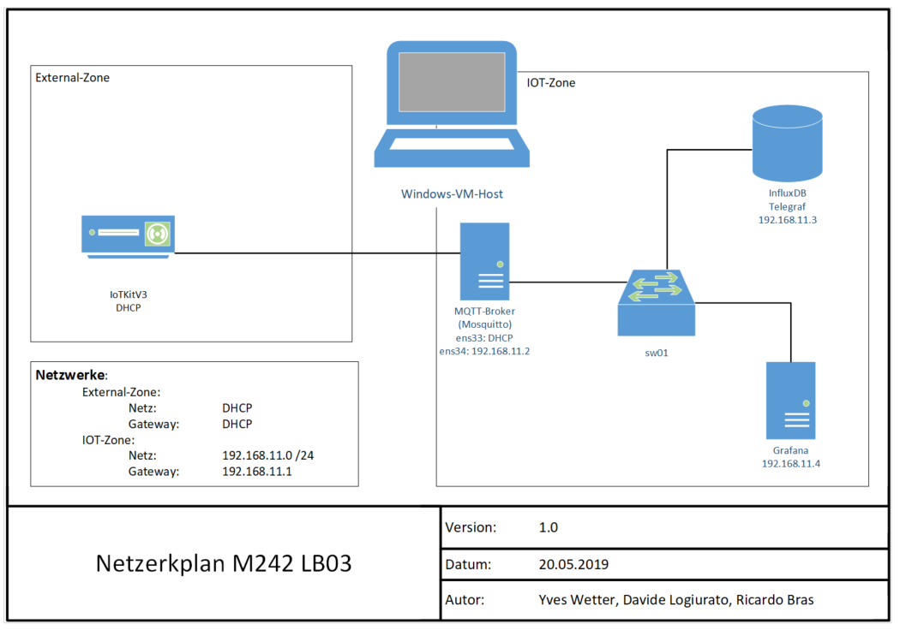
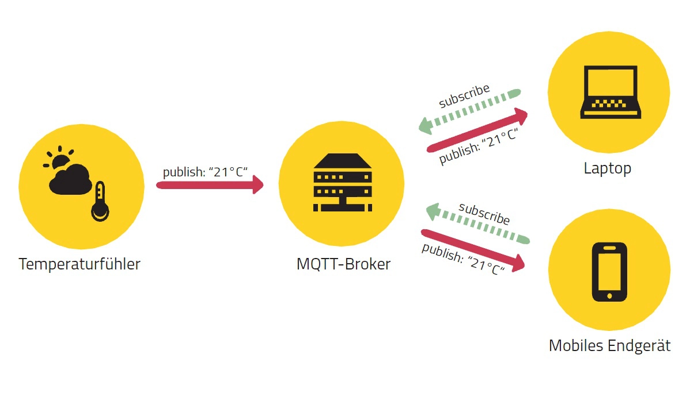
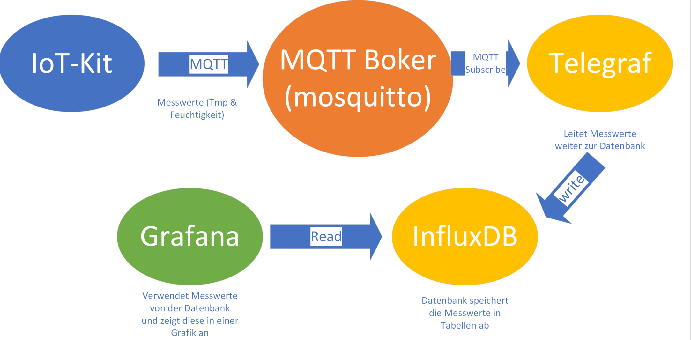

# Leistungsbeurteilung 03 (LB03)

Die nachfolgende Dokumentation basiert auf einer Projektarbeit für das Modul 242 an der Technischen Berufsschule Zürich, von Yves Wetter, Ricardo Bras und Davide Logiurato.

## 1. Beschreibung
In diesem Projekt verarbeiten wir die gleichen Daten, wie bei der LB02. Wir verfolgen den gleichen Ansatz, verwendeten aber einen Gateway und das MQTT Protokoll. Als Datenspeicher haben wir wieder die InfluxDB genommen. Damit dies aber funktioniert, mussten wir einen MQTT Broker benutzen. Dazu verwendeten wir Telegraf, welcher die Daten dann in die Datenbank schreibt. Das Grafana kann nachher die Daten grafisch von der Datenbank anzeigen.

## 2. Übersicht



- - -

## 3. Externer Sensor
Der Externe Sensor muss auf dem Board am UART-Bus an A5 angeschlossen werden.

*Achten, dass Sie die Kabel richtig verlegen!*

## 4. Dokumentation

### 4.1 MQTT
Message Queuing Telemetry Transport oder auch MQTT abgekürzt ist ein offenes Netzwerkprotokoll für die Übertragung von Telemetriedaten (Eine Übertragung von Messwerten auf drahtgebundenem oder drahtlosem Weg. In anderen Worten eine Fernmessung.) in Form von Nachrichten zwischen Geräten über eine Machine-to-Machine-Kommunikation (M2M). Dies auch bei beschränkte Netzwerke oder hohe Verzögerungen. Das MQTT-Protokoll war früher auch unter WebSphere MQTT, SCADA-Protokoll, usw. bekannt. MQTT braucht die Protokolle 1883 und 8883 und die Nachrichten können mittels dem TLS-Protokoll verschlüsselt.

MQTT erfolgt über eine Publish-Subscribe-Kommunikation. Es gibt immer zwei verschiedene Teilnehmer: Einen Boker (ist meistens ein Server) und x viele Clients. Die Clients als Publisher und Subscriber kommunizieren nicht direkt miteinander, sondern nur die Nachrichten "publishen" und "subscriben". In diesem ganzen Zusammenhang ist die Aufgabe des Brokers die Nachrichtenverwaltung und -verteilung.



Quelle: Publish/Subscribe-Architektur von MQTT. © HiveMQ.com

- - -

Diese Kommunikation hat folgende drei Vorteile:

- **Space decoupling:** Publisher und Subscriber müssen sich gegenseitig nicht kennen z.B. keine IP-Adresse oder MAC-Adresse, usw.
- **Time decoupling:** Publish und Subscribe müssen nicht zur selben Zeit ausgeführt werden.
- **Synchronization decoupling:** Die Operationen werden Asynchron ausgeführt. Dies bedeutet, dass nichts blockiert wird bei den ausführenden Computern.

**MQTT Clients**
Der Client ist der sogenannte "Endnutzer". Derjenige, der Nachrichten aktiv sendet. Ein Client kann Nachrichten eines Topics empfangen (Subscriber) als aud Nachrichten in dem gleichen Topic veröffentlichen (Publisher). MQTT ist für die Client-Seite komplett stateless dies bedeutet, dass jder Client eine Client ID hat und auch seine Session mit dieser komplett identifiziert.

**MQTT Topics**
- Jede valide MQTT-Nachricht enthält eine Payload mit einem zugehörigen Topic.
- Topics sind ähnlich wie Ordnern in einem Filesystem. So heisst ein valides topic z.B. "5OG/Zimmer6/Temperatursensor/Temperatur".
- Topics müssen von den Clients abboniert werden, um Nachrichten zu empfangen. Schließt sich nun ein neuer Client dem Netz an und schickt dem Broker eine Subscription zum Topic „5OG/Zimmer5/Temperatursensor/Temperatur“, wird der Broker alle Nachrichten mit diesem Topic an den Subscriber weiterleiten. Die Möglichkeit die abbonierten Topics zu "unsubscriben" ist ebenfalls vorhanden. Dies bedeutet wenn man keine Nachrichten von diesem Topic mehr erhalten möchte dann kann man es einfach "unsubscriben".

Das Ordnersystem der Topics lässt sich auch mit einem Mechanismus gruppieren: Diese nennen sich Single-Level-Wildcards "(+)" und Multi-Level-Wildcards "(#)"

- Die Single-Level-Wildcard kann ein Element eines Topics durch eine Wildcard ersetzen. Dies heisst bei der Topic "5OG/+/Temperatursensor/Temperatur" würden alle Nachricht empfangen werden, welche den drei angegebenen Level entsprechen. Folgende Nachrichten würden empfangen werden z.B. von "5OG/Zimmer4/Temperatursensor/Temperatur" oder "5OG/Flur/Temperatursensor/Temperatur"
- Mit der Multi-Level-Wildcard kann die ganze folgende Baumstruktur erstezt werden. Bei der Topic "5OG/#" würden alle Nachrichten empfangen werden, welche mit "5OG/" beginnen.
- Diese Wildcards können sich auch beliebig kombinieren lassen, z.B. "+/+/Temperatursensor/#" wenn man alle Temperatursensor-Daten aus allen Stöcken und Zimmern empfangen möchte.

**MQTT QoS**
Mit folgenden drei "Quality of Service" Werte werden die Nachrichten angeboten:

- 0: "Fire-and-forget" - dies ist analog dem UDP-Protokoll, das Paket wird genau einmal verschickt und es kann sein, dass es mal nicht ankommt. Enorm schnell.
- 1: "Acknowledgement" - dies ist analog dem TCP-Protokoll, das Paket wird versendet und der Empfänger bestätigt dem Sender, das Paket erhalten zu haben. Immer noch schnell.
- 2: "Synchronisiert" - das Paket wird verschickt und erreicht das Ziel, und zwar garantiert nur ein mal. Diese Variante erzeugt etwas mehr Verkehr.

**MQTT Broker**
Der Datenverkehr von MQTT wird von dem "Backend", welches sich Broker nennt, verwaltet und administriert. Die Speicerung, Verwaltung und Verteilung aller Informationen zu Topics, deren Abonnenten, Client underen IDs, Retained Messages, etc. gehören zu seinen Aufgaben. Die Bandbreite des Brokers soll trotz des sehr schmalen Protokolls bei einer sehr hohen Anzahl an Clients entsprechend dimensioniert sein. Die Netzwerkauslastung von MQTT-Kommunikationen ist trotzdem generell gering.

Die zentrale Vermittlungsplattform des MQTT Nachrichtenaustauschs wird durch den Broker dargestellt. Dies bedeutet, falls der Broker einen Ausfall erleidet, bricht die ganze Kommunikation zusammen. Sofern failsafety notwendig ist, gibt es die Möglichkeit verschiedene Broker zu "bridgen", damit ein redundantes System aufgebaut werden kann. Diese Brückenmechanik kann auch eingesetzt werden, um „Brokernetze“ zu bauen – die konfigurierbar Informationen und Nachrichten zu verschiedenen Topics austauschen und an ihre entsprechenden Clients weiterreichen.

### 4.2 Mosquitto
Eclipse Mosquitto ist ein Open Source-Nachrichtenbroker (EPL / EDL-lizenziert), der die MQTT-Protokollversionen 5.0, 3.1.1 und 3.1 implementiert. Mosquitto ist leicht und eignet sich für alle Geräte, von Single-Board-Computern mit geringem Stromverbrauch bis hin zu vollständigen Servern.

Mit seiner guten Community-Unterstützung, Dokumentation und einfachen Installation wurde es zu einem der beliebtesten MQTT-Broker. Mosquitto kann wie jeder andere MQTT-Server („Broker“) als Zustands-Datenbank benutzt werden, da die gesamte Datenlage seiner Kommunikationspartner gehalten wird. Die MQTT-Geräte, die mit einem MQTT-Broker wie Mosquitto verbunden sind, nehmen nämlich nicht nur Befehle entgegen, sondern sammeln auch Daten ein.

Das MQTT-Protokoll bietet eine einfache Methode zum Ausführen von Nachrichten mithilfe eines Publish / Subscribe-Modells. Dies macht es für Internet-of-Things-Nachrichten geeignet, z. B. mit Sensoren mit geringem Stromverbrauch oder mobilen Geräten wie Telefonen, eingebetteten Computern oder Mikrocontrollern.


### 4.3 Telegraf
Telegraf ist ein Plugin-gesteuerter Server-Agent zum Sammeln und Berichten von Metriken und ist das erste Stück des TICK-Stapels. Telegraf verfügt über Plugins, um eine Vielzahl von Metriken direkt aus dem System, auf dem er läuft, zu beziehen, Metriken aus APIs von Drittanbietern abzurufen oder sogar über eine Statistik und Kafka-Konsumentendienste nach Metriken zu suchen. Es verfügt auch über Output-Plugins, um Metriken an eine Vielzahl anderer Datenspeicher, Dienste und Nachrichtenwarteschlangen zu senden, einschließlich InfluxDB, Graphite, OpenTSDB, Datadog, Librato, Kafka, MQTT, NSQ und viele andere.

**Die wichtigsten Merkmale**
Hier sind einige der Funktionen, die Telegraf derzeit unterstützt und die es zu einer großartigen Wahl für die Sammlung von Metriken machen.

- Vollständig in Go geschrieben. Es lässt sich in eine einzige Binärdatei ohne externe Abhängigkeiten kompilieren.
- Minimaler Speicherbedarf.
- Das Plugin-System ermöglicht das einfache Hinzufügen neuer Ein- und Ausgaben.
- Eine große Anzahl von Plugins für viele populäre Dienste existiert bereits für bekannte Dienste und APIs.
  
### 4.4 InfluxDB
InfluxDB ist ein hochleistungsfähiger Datenspeicher, der im Besonderen für Zeitreihendaten erfunden wurde. Er erlaubt Datenerfassung mit hohem Durchsatz sowohl Komprimierung und Echtzeitabfragen der erfassten Informationen. InfluxDB kommt in allen Anwendungsfällen als Datenspeicher zum Einsatz, binnen denen enorme Mengen von Fakten mit Zeitstempel verarbeitet werden, exemplarisch DevOps-Überwachungsdaten, Protokolldaten, Anwendungsmetriken, Fakten von IoT-Sensoren oder Echtzeitanalysedaten. Der Datenspeicher stellt genauso alternative Charakteristika disponibel, außerdem Datenaufbewahrungsrichtlinien. InfluxDB Enterprise offeriert Hochverfügbarkeit ebenso eine hochgradig erweiterbare Clustering-Lösung für Bereiche der Applikation mit Zeitreihendaten.

Deshalb ist es perfekt für IOT-Geräte, wie zum Beispiel Sensoren.

### 4.5 Grafana
Grafana ist eine Open-Source-Visualisierungs- und Analysesoftware. Sie erlaubt es, Metriken abzufragen, zu visualisieren, zu alarmieren und zu erforschen, unabhängig davon, wo sie gespeichert sind. Das bedeutet, dass es Werkzeuge zur Verfügung stellt, mit denen man Zeitreihendatenbank (TSDB) in schöne Grafiken und Visualisierungen verwandeln können.

**Metriken und Protokolle**

Erkunden von Daten durch Ad-hoc-Abfragen und dynamische Drilldown-Analyse. Ansicht aufteilen und vergleichen von verschiedene Zeitbereiche, Abfragen und Datenquellen nebeneinander.

**Alerts**

Wenn man die Grafana-Alarmierung verwendet, kann man die Alarme über eine Reihe von verschiedenen Alarmbenachrichtigern senden lassen, einschließlich PagerDuty, SMS, E-Mail, VictorOps, OpsGenie oder Slack.

Mit Hilfe von Alert Hooks kann man mit ein wenig Code verschiedene Melder erstellen, wenn man andere Kommunikationskanäle bevorzugt. Definiert man visuell Alarmregeln für die wichtigsten Metriken.

**Anmerkung**

Diese Funktion, die in Grafana als Graph-Marker angezeigt wird, ist nützlich, um Daten zu korrelieren, falls etwas schief geht. Man kann die Anmerkungen manuell erstellen - klicken man einfach bei gedrückter Strg-Taste auf ein Diagramm und gibt etwas Text ein - oder man kann Daten aus jeder Datenquelle abrufen.

**Dashboard-Variablen**

Mit Vorlagenvariablen kann man Dashboards erstellen, die für viele verschiedene Anwendungsfälle wiederverwendet werden können. Die Werte sind mit diesen Vorlagen nicht fest programmiert, so dass man z.B., wenn man einen Produktions- und einen Testserver hat, für beide dasselbe Dashboard verwenden kann.

Das Templating ermöglicht einem die Drill-Down-Analyse seiner Daten, z.B. von allen Daten bis hin zu Nordamerika-Daten, bis hinunter zu Texas-Daten und darüber hinaus. Man kann diese Dashboards auch von Teams innerhalb seines Unternehmens gemeinsam nutzen - oder wenn man eine großartige Dashboard-Vorlage für eine beliebte Datenquelle erstellt, kann man sie der gesamten Community zur Anpassung und Nutzung zur Verfügung stellen.

**Grafana Konfiguration**

Wenn man ein Grafana-Administrator ist, dann wird man sich gründlich mit den Grafana-Konfigurationsoptionen und der Grafana-CLI vertraut machen wollen.

Die Konfiguration umfasst sowohl die Konfigurationsdateien als auch die Umgebungsvariablen. Man kann Standard-Ports, Protokollierungsebenen, E-Mail-IP-Adressen, Sicherheit und mehr einrichten.

**Authentifizierung**

Grafana unterstützt verschiedene Authentifizierungsmethoden, wie LDAP und OAuth, und ermöglicht die Zuordnung von Benutzern zu Organisationen.

In Grafana Enterprise kann man auch Benutzer zu Teams zuordnen: Wenn die Firma über ein eigenes Authentifizierungssystem verfügt, kann man in Grafana die Teams in Ihren internen Systemen den Teams in Grafana zuordnen. Auf diese Weise kann man Personen automatisch Zugang zu den Dashboards geben, die für ihre Teams bestimmt sind.

**Provisioning**

Während es einfach ist, durch Klicken, Ziehen und Ablegen ein einziges Dashboard zu erstellen, werden Power-User, die viele Dashboards benötigen, das Setup mit einem Skript automatisieren wollen. Man kann in Grafana jedes beliebige Skript erstellen.

Wenn man z.B. einen neuen Kubernetes-Cluster einrichtet, kann man auch ein Grafana automatisch mit einem Skript starten, das den richtigen Server, die richtige IP-Adresse und die richtigen Datenquellen voreingestellt und gesperrt hat, so dass die Benutzer sie nicht ändern können. Es ist auch eine Möglichkeit, die Kontrolle über viele Dashboards zu erhalten.

**Genehmigungen**

Wenn Organisationen eine Grafana und mehrere Teams haben, wollen sie oft die Möglichkeit haben, die Dinge getrennt zu halten und Dashboards gemeinsam zu nutzen. Man kann ein Team von Benutzern erstellen und dann Berechtigungen auf Ordner, Dashboards und bis auf die Ebene der Datenquellen festlegen, wenn man Grafana Enterprise verwenden.

**Grafana-Cloud**

Grafana Cloud ist eine hochverfügbare, schnelle, vollständig verwaltete OpenSaaS-Logging- und Metrik-Plattform. Alles, was man an Grafana lieben, aber Grafana Labs hostet es für einen und erledigt alle Kopfschmerzen.

**Grafana Enterprise**
Grafana Enterprise ist eine kommerzielle Version von Grafana, die zusätzliche Funktionen enthält, die in der Open-Source-Version nicht zu finden sind.

Aufbauend auf allem, was man bereits wissen und an Grafana liebt, fügt Grafana Enterprise Unternehmensdatenquellen, erweiterte Authentifizierungsoptionen, mehr Berechtigungskontrollen, 24x7x365-Support und Schulungen durch das Grafana-Kernteam hinzu.

### 4.6 Kommunikation
Folgendes Diagramm beschreibt die Kommunikation vom Entwickelten Service. 



### 4.7 Sicherheitkonzept
Die Passwörter werden bei jeder Vagrant Installation generiert. das Passwort ist immer 20 Zeichen lang. Somit ist es sehr sicher gegen Bruteforce Attacken.

Die Passwörter können nach der Installation hier gefunden werden:
```
./install/InfluxDB_(iotkit,superuser).txt
```
### 4.8 Datenkonzept
Die Daten werden abgespeichert, so wie es InfluxDB empfiehlt. Das heisst pro Messung zum Beispiel von Temperaturmessungen vom Internen Sensor wird in die Datenbank als eine Tabelle geschrieben. Dies spielt aber keine grosse Rolle, da immer der Hostname auch in die Datenbank geschreiben wird. Somit haben wir folgende Tabellen:
- inhumity
- exhumity
- intemperature
- extemperature

### 4.9 Kompilieren
*Achtung bei jeder neuen Installation mit Vagrant muss das WLAN und die MQTT-Broker Server Adresse angepasst werden*

Im [Online Compiler](https://os.mbed.com/compiler/) .                                                                    

## 5. Installation
Für die Installation müssen folgende Schritte gemacht werden:
1. git klonen (git clone https://github.com/tbz-m242/LB3-MQTT-InfluxDB.git)
2. cd LB3-MQTT-InfluxDB
3. vagrant up
4. Im ./src kann man das main.cpp finden. Dort muss der Hostname des MQTT-Broker angegeben werden.
5. Danach muss noch die WLAN konfigurationen angepasst werden.
6. Zum Schluss kann man mit dem Mbed-CLI der Ordner ./src kompilieren.
7. .bin Datei auf den IoTKitv3 laden.

## 6. Testprotokoll
Das Testprotokoll kann hier gefunden werden:
[Testprotokoll](TestProtokoll.md)

